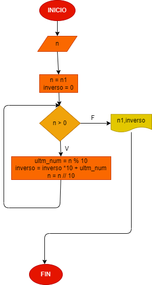

# Hacer el diagrama de flujo que lea el numero , entero y positivo, de cualquier numero de digitos , que calcule su numero inverso, y que imprima con su numero leido

# Analisis

## Diagrama de flujo.
